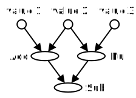
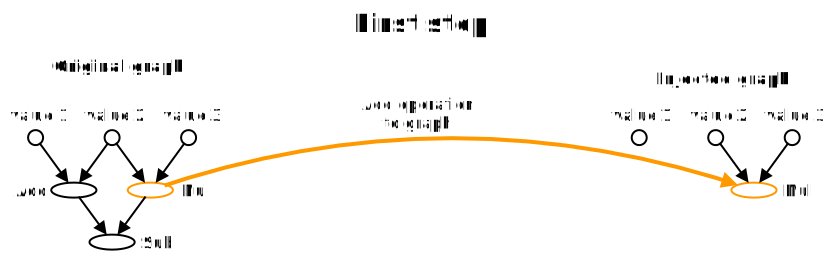
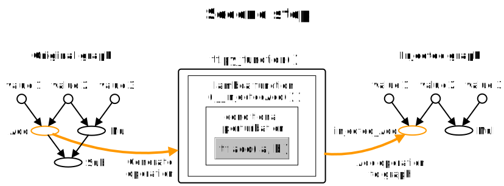
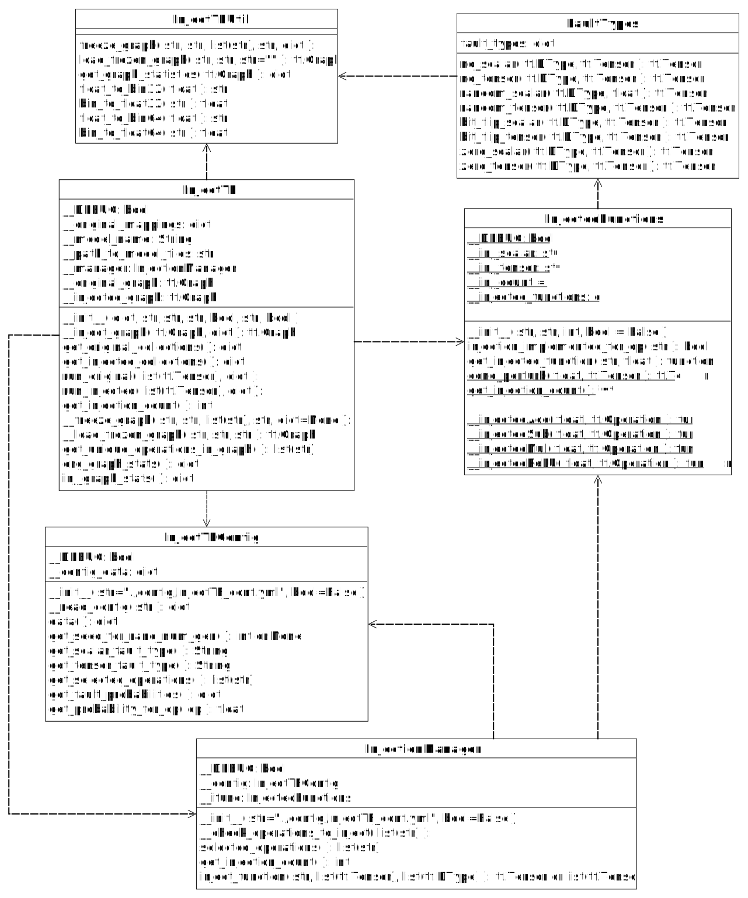

## InjectTF - a fault injection framework for TensorFlow

InjectTF is a Python 3 framework for fault injection into TensorFlow models. It builds a fault-injected counterpart to a given neural network, based on a user-defined configuration file. Using the framework, it is possible to inject faults into TensorFlow operations within the network and analyze the performance of the model when exposed to faults.

> Note: 
> The framework has been tested with TensorFlow version 1.13.1 and will most definetly not work with TensorFlow 2.0. However, TF 2.0 is currently being evaluated. In the near future, InjectTF will be updated to work with TF 2.0.

----
### Overview
- [Working principle](#working-principle)
- [Usage](#usage)
- [Class diagram](#class-diagram)
- [Tests](#tests)
----
### Working principle

Consider the graph of a simple network with the three inputs `value1`, `value2`, `value3`, and the operations `Add`, `Sub`, and `Mul` as shown in the next figure.

To generate the fault injected counterpart of the "original" graph, InjectTF will iterate over all operations in the network and copy all operations to the "injected" graph. However, if an operation that is selected for fault injecion is encountered, a fault injected version is added to the injected graph instead.

As an example, the `Add` operation of the previously shown network is selected for injection.

In the first step, the `Mul` operation is encountered. Since it is not selected for injection, it is added to the injected graph without modification.

In the second step, an `Add` operation is encountered, therefore an injected counterpart is created. This is done by wrapping the standard TensorFlow operation. That means, that all computations in the injected network still rely on the standard TensorFlow implementation. Only the result of the "injected" operation is altered afterwards.

In the third step the `Mul` operation is added to the injected graph without modification.

Now the original and the injected graph exist side by side and can be used for experiments.

----

### Usage

Please refer to the examples in the `example` folder for details on how to use the framework.

----

### Class diagram

----

### Tests

To run the tests execute the shell script `run_unittests.sh`.
